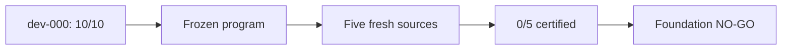

# RoboCasa partial-containment foundation result

## Decision: NO-GO

**Independent sources certified:** `0/5`

**Required for GO:** at least `4/5`

**Development source:** certified `10/10` in every group, but excluded from `n`

The mechanism worked on the development episode but did not transfer under the
frozen authoring program. No source was replaced, no fresh result was used to
retune the program, and no VLA was run.



## Experimental unit

The independent unit is a source episode, not a rollout. Ten repeats test
reproducibility within each source. The five frozen sources have distinct
episode IDs, layouts, and model XMLs: episodes `2, 4, 6, 7, 9`.

`dev-000-foodcleanup-cabinet-obstruction` (episode 0) was used only to author,
calibrate, and debug the program. Its successful repeats are not pooled with
the fresh evidence.

## Source-level evidence

| Source | Search/start | Bad | Safe twin | Recovery | Restart | Certified |
| --- | --- | ---: | ---: | ---: | ---: | ---: |
| episode 2, mango | `0.60` qualified; `0.65` offset unstable | 0/10 | 10/10 | 0/10 | 0/10 | no |
| episode 4, corn | `0.60` qualified; `0.65` offset valid | 10/10 | 10/10 | 0/10 frozen gate | 10/10 | no |
| episode 6, bell pepper | every grid start rejected | — | — | — | — | no |
| episode 7, onion | every grid start rejected | — | — | — | — | no |
| episode 9, bell pepper | all starts valid; no unsafe point through `1.60` | — | — | — | — | no |

The dashes mean the source correctly stopped before final repeat groups because
the frozen search/start gate failed. They are not missing or replaced sources.

### Why each source failed

- **Episode 2:** `0.60` extents caused unsafe closure `10/10`, but the fixed
  `0.05` robustness offset made the final `0.65` state unstable. It translated
  `7.3 cm`, rotated about `1.02 rad`, and had `1.01 m/s` linear speed during the
  start audit.
- **Episode 4:** all scientific recovery outcomes were actually successful
  `10/10`: CloseReadySet, safe fixture closure, and original FoodCleanup
  success. The frozen report still rejected each repeat because the preceding
  fingerpad motion hit its 180-step timeout at `18.7 mm` error. The primary
  frozen result remains failed; this non-semantic sensitivity is not repaired
  after seeing the fresh source.
- **Episode 6:** every grid point failed only the robot-velocity start bound;
  the measured value was `1.44`, above the frozen `0.25` limit.
- **Episode 7:** every grid point failed fixture stability; normalized openness
  drifted `0.0376`, above the frozen `0.01` limit.
- **Episode 9:** all grid starts were valid, but the nominal closure never
  triggered the frozen unsafe predicate at any tested point through `1.60`
  object extents.

## Repeat-level evidence

These totals describe completed frozen repeat groups; they do not change the
independent sample count.

| Frozen certification count | Total |
| --- | ---: |
| Safe/stable/incomplete starts | 10 |
| Unsafe bad branches | 10 |
| Safe original-task successes on natural twins | 20 |
| Certified physical recoveries | 0 |
| Identity/restart equivalence | 10 |

Episode 4 additionally had `10/10` semantic physical-recovery outcomes, but
all ten remained uncertified under the frozen intermediate timeout gate.

## Development result, reported separately

The revised development source passed start, bad branch, natural safe twin,
physical recovery, and identity/restart equivalence `10/10` (Quest job
`5272419`). Its normalized search chose `0.60` extents plus the fixed `0.05`
offset. Recovery reached CloseReadySet at `18.25 s` and took `59.0 s` in every
repeat.

The historical 989-action witness took `49.45 s`, versus a `17.55 s` nominal
suffix (`31.90 s` overhead). The revised witness was not optimized; efficiency
is outside this phase.

## Frozen program

- Canonical task: `FoodCleanup`; original `_check_success` unchanged.
- Canonical restart: fresh construction plus action-prefix replay.
- Hazard search: object-extent grid `0.10–1.60`, ten repeats per point,
  smallest `9/10` unsafe point, fixed `0.05` offset.
- Matched comparison: hazardous state and natural safe twin use the same
  original nominal closure.
- Recovery: physical robot object repositioning, then CloseReadySet.
- Post-CloseReady closure: bounded physical fixture-joint PD; no cabinet state
  edit and no replay of the source closure suffix.
- No exact branch-pose return requirement.
- No per-source code path and no VLA outcome in authoring or search.

The complete semantic definitions and thresholds are in `PREDICATE_SPEC.md`.

## Severity and provenance

The obstruction predicate required food/door contact plus frozen force,
impulse, closure-stall, translation, or rotation evidence. Rollouts continued
after first contact and retained the full severity trace.

Final audit result:

```text
audit_valid=true
foundation_go=false
independent_source_count=5
certified_source_count=0
```

Audit artifact:

```text
/projects/p33100/siosio/robocasa_foundation_runs/
  f5_final_audit_5273093/report/foundation_audit.json
```

Fresh reports:

```text
/projects/p33100/siosio/robocasa_foundation_runs/
  f5_fresh_5273093_{0,1,2,3,4}/certification/certification.json
```

## Environment and licenses

| Component | Pin | License |
| --- | --- | --- |
| RoboCasa | `1.0.1` | MIT |
| robosuite | `1.5.2` | MIT |
| MuJoCo | `3.3.1` | Apache-2.0 |
| RoboCasa assets/demos | v1.0 package | CC-BY-4.0 |

Exact revisions, locations, and the optional LeRobot conversion limitation are
in `DEPENDENCY_AUDIT.md` and `ENVIRONMENT_HANDOFF.md`.

## Visual evidence

The original source, bad branch, safe twin, and historical physical-recovery
GIF paths are preserved in `INITIAL_RESULT.md`. A representative revised
semantic recovery is:

```text
/projects/p33100/siosio/robocasa_foundation_runs/
  f5_semantic_recovery_5272319/recovery/semantic_recovery.gif
```

Large media remain outside Git.

## Key Quest runs

| Purpose | Job/run ID |
| --- | ---: |
| Freeze five sources | `5262642` |
| Calibrate severity | `5263563` |
| Successful searched-margin diagnostic | `5272319` |
| Full revised dev certification | `5272419` |
| Frozen five-source array | `5273093` |
| Final integrity audit | `f5_final_audit_5273093` |

## Interpretation

This is useful negative evidence for a paper: a successful hand-developed
branch point did not imply mechanism transfer. The failures separate four
issues that would otherwise be hidden by repeat pooling:

1. robustness offset can invalidate an otherwise qualifying critical point;
2. non-semantic primitive gates can reject a safe successful recovery;
3. transition states have source-dependent robot/fixture dynamics; and
4. the same displacement family does not guarantee an obstruction in every
   layout/object instance.

## Next authorized step

Stop before VLA evaluation, new tasks, replacement sources, or a confirmatory
cohort. The next useful work is a paper-facing postmortem and a separately
authorized second authoring protocol that addresses these four transfer
failures with a new frozen cohort. The existing five outcomes must remain the
primary first-cohort result.
