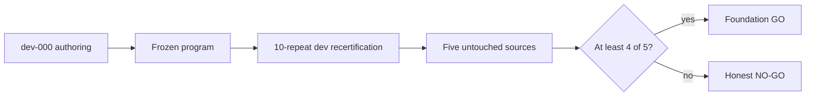

# RoboCasa foundation status

**Last updated:** 2026-09-01

**Phase:** development recertification correction before the final freeze

**Foundation verdict:** **PENDING** — no fresh-source result has been counted yet

## At a glance

| Question | Answer |
| --- | --- |
| What are we doing? | Certifying one partial-containment mechanism on five frozen FoodCleanup sources. |
| What is working? | Environment, source replay, restart protocol, critical-margin search, severity monitor, CloseReadySet, physical object recovery, and bounded fixture closure. |
| What is the current problem? | The searched dev hazard missed the recovery grasp by about 20 mm; fresh transfer has not started. |
| What are we not doing? | No new task, failure category, VLA, policy tuning, or extra source replacement. |

## Frozen source count

The first-round episode is now
`dev-000-foodcleanup-cabinet-obstruction`. It is development evidence only and
never counts toward the independent sample.

Quest job `5262642` froze and verified these five sources before revised
authoring:

| Source | Episode | Layout | Object instruction |
| --- | ---: | ---: | --- |
| `source-001` | 2 | 32 | mango |
| `source-002` | 4 | 28 | corn |
| `source-003` | 6 | 41 | bell pepper |
| `source-004` | 7 | 21 | onion |
| `source-005` | 9 | 55 | bell pepper |

They have distinct source IDs, layouts, and model XMLs. Failed sources will not
be replaced.

## What is verified

- Quest environment: RoboCasa `1.0.1`, robosuite `1.5.2`, MuJoCo `3.3.1`.
- Canonical task: unchanged `FoodCleanup` task and success predicate.
- Canonical restart: fresh construction plus deterministic action-prefix replay.
- Historical restart audit: nominal success and identity `10/10` in all three
  tested restart modes (job `5242278`).
- Source-freeze audit: passed (job `5262642`).
- Zero-GPU suite: `25/25` passed on Quest after program freeze.
- Severity calibration: ten safe closures were contact-free; the normalized
  obvious obstruction contacted in `10/10` (job `5263563`).
- Development semantic diagnostic: CloseReadySet reached before closure;
  unchanged FoodCleanup success true; no obstruction evidence (job `5270914`).
- Candidate authoring program was frozen at commit `f545013`; no fresh
  authoring preceded it.

## Frozen semantics

- Search uses object-extent fractions, ten repeats per point, the smallest
  `9/10` violation point, and a fixed `0.05`-extent robustness offset.
- Unsafe obstruction requires food/door contact plus calibrated force, impulse,
  stall, translation, or rotation evidence.
- Recovery must enter CloseReadySet; exact frame-370 pose return is not scored.
- The hazardous and natural-safe-twin branches use the same nominal suffix.
- Recovery uses physical robot object repositioning followed by a bounded,
  physical fixture-joint PD skill; it never replays the source closure suffix or
  edits cabinet state.

Full parameters and the simple branch diagram are in `PREDICATE_SPEC.md`.

## Development timing

The historical 989-action witness remains preserved: `49.45 s` physical
duration versus a `17.55 s` nominal suffix, or `31.90 s` overhead.

The revised successful development diagnostic used 1,172 actions (`58.60 s`).
CloseReadySet was reached at `23.85 s`; overhead relative to the nominal suffix
was 821 actions (`41.05 s`). These are measurements, not optimization targets.

## Current result and next gate

Frozen dev job `5271204` passed start validity, bad closure, safe twin, and
identity/restart equivalence `10/10`, but recovery was `0/10`. The same generic
fingerpad alignment stopped at `20.1 mm` error and failed to grasp in every
repeat. This occurred at the searched `0.65`-extent hazard; the successful
development diagnostic at `0.85` extents had reached `16 mm` alignment error.

The program is reopened only to tighten that generic semantic termination to
`10 mm`, then dev will be recertified again. Fresh sources remain untouched.
Only after dev passes will the exact program be frozen and the single
five-source array run. Each source must independently provide ten repeats of
start validity, bad nominal closure, safe twin, physical recovery, and
identity/restart equivalence.

Foundation `GO` requires at least four certified fresh sources. Repeat totals
will be reported separately from the independent source count `n=5`.

## Kept as history

The original report and its GIF paths remain in `INITIAL_RESULT.md`. Detailed
failed authoring traces remain under the Quest run root; the status page no
longer repeats the full chronological debugging log.

The only environment limitation is the already documented optional LeRobot
conversion dependency. It does not affect the simulator or this certification.
