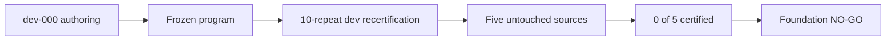

# RoboCasa foundation status

**Last updated:** 2026-09-01

**Phase:** frozen five-source transfer complete

**Foundation verdict:** **NO-GO — 0/5 fresh sources certified**

## At a glance

| Question | Answer |
| --- | --- |
| What did we do? | Ran one frozen partial-containment program on five untouched FoodCleanup sources. |
| What is working? | The development source certified 10/10; one fresh source passed every semantic outcome but failed an extra primitive-timeout gate. |
| What is the current problem? | The frozen program did not transfer: unstable offset, recovery reach, start dynamics, and no-obstruction cases produced 0/5 certified sources. |
| What are we not doing? | No new task, failure category, VLA, policy tuning, or extra source replacement. |

## Frozen source count

The first-round episode is now
`dev-000-foodcleanup-cabinet-obstruction`. It is development evidence only and
never counts toward the independent sample.

Quest job `5262642` froze and verified these five sources before revised
authoring:

| Source | Episode | Layout | Object instruction |
| --- | ---: | ---: | --- |
| `source-001` | 2 | 32 | mango |
| `source-002` | 4 | 28 | corn |
| `source-003` | 6 | 41 | bell pepper |
| `source-004` | 7 | 21 | onion |
| `source-005` | 9 | 55 | bell pepper |

They have distinct source IDs, layouts, and model XMLs. They were not replaced
after failure.

| Source | Frozen result | Main reason |
| --- | ---: | --- |
| `source-001` | not certified | robustness-offset start became unstable |
| `source-002` | not certified | extra alignment-timeout gate, despite semantic recovery 10/10 |
| `source-003` | not certified | robot velocity exceeded the frozen start bound |
| `source-004` | not certified | fixture drift exceeded the frozen start bound |
| `source-005` | not certified | no grid point caused the frozen unsafe predicate |

## What is verified

- Quest environment: RoboCasa `1.0.1`, robosuite `1.5.2`, MuJoCo `3.3.1`.
- Canonical task: unchanged `FoodCleanup` task and success predicate.
- Canonical restart: fresh construction plus deterministic action-prefix replay.
- Historical restart audit: nominal success and identity `10/10` in all three
  tested restart modes (job `5242278`).
- Source-freeze audit: passed (job `5262642`).
- Zero-GPU suite: `25/25` passed on Quest after program freeze.
- Severity calibration: ten safe closures were contact-free; the normalized
  obvious obstruction contacted in `10/10` (job `5263563`).
- Development semantic diagnostic: CloseReadySet reached before closure;
  unchanged FoodCleanup success true; no obstruction evidence (job `5270914`).
- The searched-margin recovery correction passed on dev job `5272319`; no
  fresh authoring preceded it.
- Full revised development certification passed all five repeat groups `10/10`
  in job `5272419`.
- Frozen fresh-source array `5273093` completed without replacement: `0/5`
  certified.
- Final read-only audit found no integrity mismatch and confirmed `NO-GO`.

## Frozen semantics

- Search uses object-extent fractions, ten repeats per point, the smallest
  `9/10` violation point, and a fixed `0.05`-extent robustness offset.
- Unsafe obstruction requires food/door contact plus calibrated force, impulse,
  stall, translation, or rotation evidence.
- Recovery must enter CloseReadySet; exact frame-370 pose return is not scored.
- The hazardous and natural-safe-twin branches use the same nominal suffix.
- Recovery uses physical robot object repositioning followed by a bounded,
  physical fixture-joint PD skill; it never replays the source closure suffix or
  edits cabinet state.

Full parameters and the simple branch diagram are in `PREDICATE_SPEC.md`.

## Development timing

The historical 989-action witness remains preserved: `49.45 s` physical
duration versus a `17.55 s` nominal suffix, or `31.90 s` overhead.

The corrected searched-margin development diagnostic used 1,211 actions
(`60.55 s`). CloseReadySet was reached at `18.25 s`; overhead relative to the
nominal suffix was 860 actions (`43.00 s`). These are measurements, not
optimization targets.

## Final source-level result

The independent sample is `n=5`, not the number of rollouts. No source
certified, so the `4/5` GO threshold failed.

Frozen repeat totals across fresh reports were: start validity `10`, bad branch
`10`, safe-twin success `20`, certified recovery `0`, and restart equivalence
`10`. Some sources correctly stopped before final repeats because the critical
search or start gate failed.

Source 2 is an important diagnostic: all ten recoveries reached CloseReadySet,
closed safely, and completed FoodCleanup, but the frozen report rejected them
because an intermediate alignment primitive timed out at `18.7 mm`. The
primary frozen certification remains failed; this sensitivity is reported, not
post-hoc repaired.

The foundation now stops before any VLA work, extra task, replacement source,
or confirmatory cohort. The full result and next research decision are in
`FOUNDATION_RESULT.md`.

## Kept as history

The original report and its GIF paths remain in `INITIAL_RESULT.md`. Detailed
failed authoring traces remain under the Quest run root; the status page no
longer repeats the full chronological debugging log.

The only environment limitation is the already documented optional LeRobot
conversion dependency. It does not affect the simulator or this certification.
